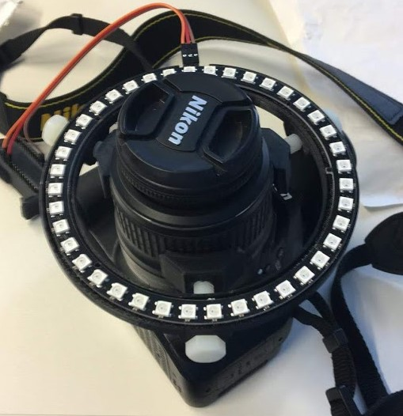
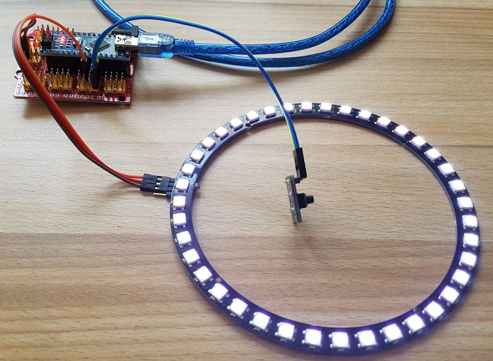
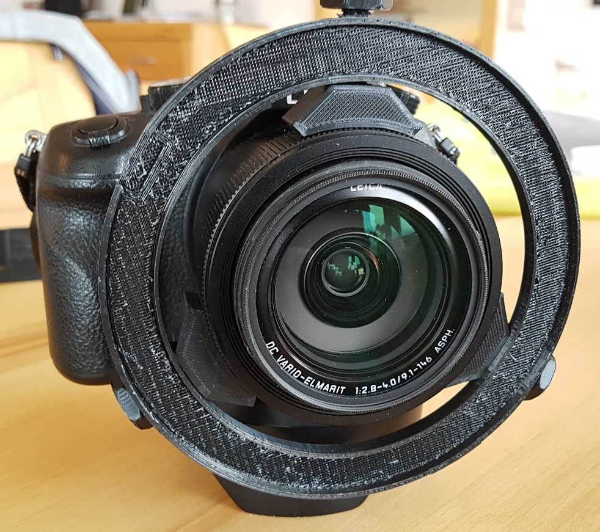

# Camera LED Ring

<table><tr>
<td></td>
<td></td>
<td></td>
</tr></table>

This project is about a LED ring which can be mounted on camera lences in oder to get a proper light for close shots. 
The LED ring is based on WS2812 like [Adafruit NeoPixel](https://www.adafruit.com/category/168). 
For the controller I chose an [Arduino Nano](https://store.arduino.cc/arduino-nano). 
The power supply works via the usb connector which is on the arduino nano board. 
In addition I just plugged in a simple button which I can use for adjusting the brightness of the LED ring. 
For this project I just use the color white and all LEDs change their color at the same time.
The program is based on [platform.io](https://platformio.org/) and on the Adafruit library for NeoPixel. 
You find this simple program in [src/main.cpp](src/main.cpp).

By pushing the button the program increases the brightness until it has reached max, after that it decreases the brightness ... if you release the button it will stop and keep this configuration. 
If you power of it will always set the brightness to what is set as default value in the program.

For mounting the LED ring I printed the following parts:  
3x [screws](3d-printed-parts/screwM8_25.stl)  
3x [lens connector](cameraSupportM8.stl)  
1x [ring support](universal-led-ring-mount.stl)  

For creating the screws I use a library called ["NUT JOB | Nut, Bolt, Washer and Threaded Rod Factory"](https://www.thingiverse.com/thing:193647). Here are also links to project about the ring support: [Universal LED Ring Light Mount](https://www.thingiverse.com/thing:2548178) and [Universal LED Ring Light Mount Minimal](https://www.thingiverse.com/thing:2850113)
